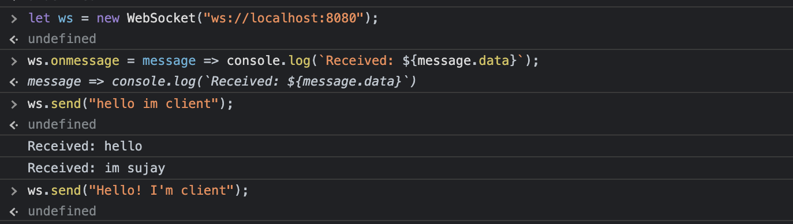
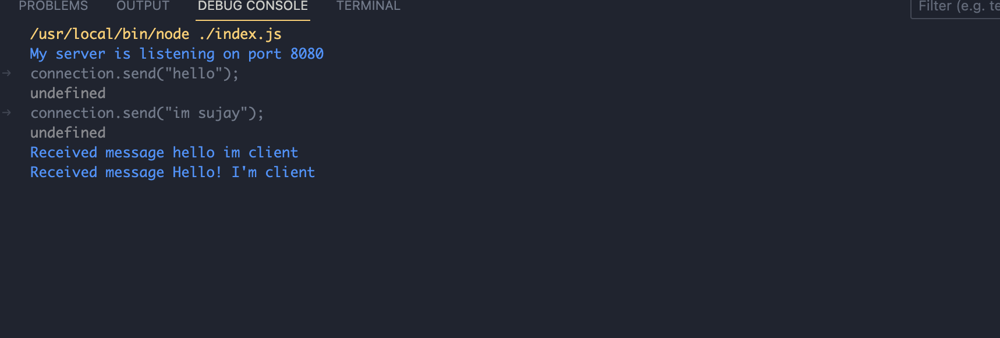

# WebSockets

## Installation

WebSockets technology is a bidirectional, full-duplex protocol for communication between client and server over the web. This protocol enables realtime applications such as chatting, notifications, live feed , multiplayer gaming and otheruse cases.

## Usage
Client:

Server

## License

[MIT](https://choosealicense.com/licenses/mit/)