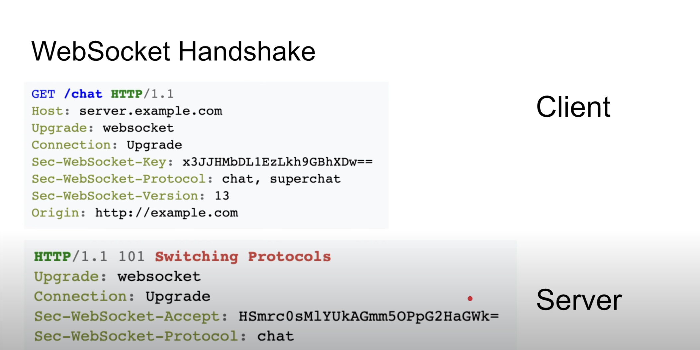

# WebSockets

## Installation

WebSockets technology is a bidirectional, full-duplex protocol for communication between client and server over the web. This protocol enables realtime applications such as chatting, notifications, live feed , multiplayer gaming and other usecases This is the Demo of websockets using NodeJS .

## Usage
Client:
 

 
 
Server:

## How WebSocket works

## License

[MIT](https://choosealicense.com/licenses/mit/)